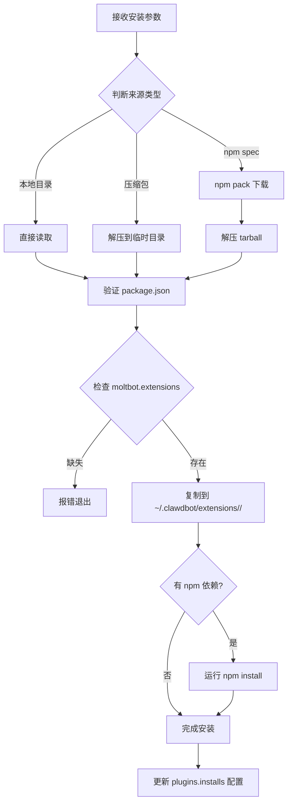
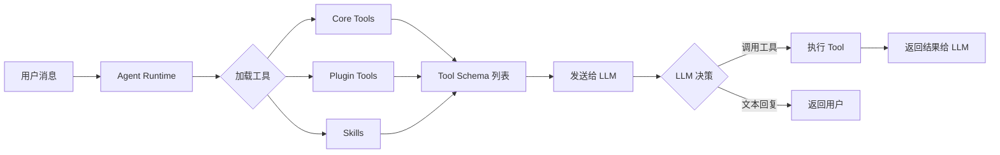
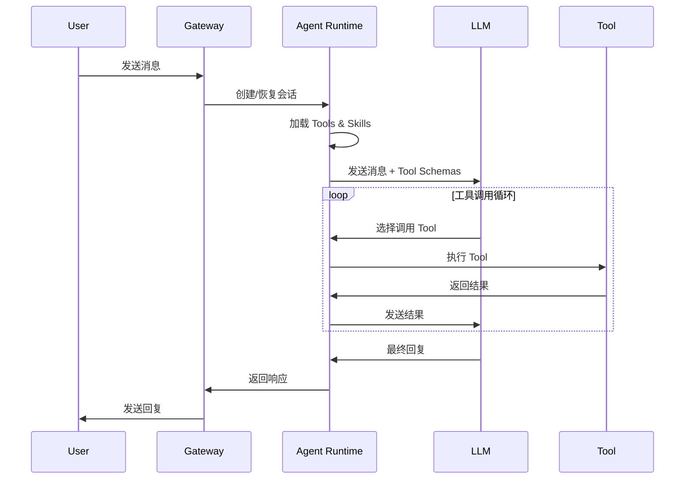

# Moltbot 插件机制研究文档

## 目录
1. [概述](#概述)
2. [Plugin Install 命令流程](#plugin-install-命令流程)
3. [Extensions 目录规则](#extensions-目录规则)
4. [自研插件指南](#自研插件指南)
5. [模型集成机制](#模型集成机制)
6. [Tool 与 Skill 选择执行机制](#tool-与-skill-选择执行机制)

---

## 概述

Moltbot 采用**去中心化的插件发现和加载机制**，允许通过 TypeScript/JavaScript 模块扩展系统功能。

**核心特点：**
- 使用 **jiti** 进行运行时 TypeScript 转译，无需预编译
- 插件在 Gateway 进程内运行，视为受信任代码
- 支持注册：Gateway RPC 方法、HTTP 处理器、Agent 工具、CLI 命令、后台服务、Skills、自动回复命令

---

## Plugin Install 命令流程

### CLI 入口
```bash
moltbot plugins install <path-or-spec>
```

### 核心实现文件
- `src/cli/plugins-cli.ts` - CLI 命令注册
- `src/plugins/install.ts` - 安装逻辑

### 安装流程



### 支持的安装源
| 类型 | 示例 | 说明 |
|------|------|------|
| npm 包 | `@moltbot/voice-call` | 从 npm registry 下载 |
| 本地目录 | `./extensions/voice-call` | 复制整个目录 |
| 压缩包 | `./plugin.tgz`, `./plugin.zip` | 自动解压 |
| 链接模式 | `-l ./my-plugin` | 不复制，添加到 `plugins.load.paths` |

### 安装目标位置
- 默认: `~/.clawdbot/extensions/<plugin-id>/`
- 可通过 `--extensions-dir` 指定

---

## Extensions 目录规则

### 发现优先级（从高到低）

1. **Config paths**: `plugins.load.paths` 配置
2. **Workspace extensions**: `<workspace>/.clawdbot/extensions/`
3. **Global extensions**: `~/.clawdbot/extensions/`
4. **Bundled extensions**: `<moltbot>/extensions/` (默认禁用)

### 目录结构要求

#### 最小结构（package pack）
```
my-plugin/
├── package.json          # 必须包含 moltbot.extensions
├── moltbot.plugin.json   # 插件清单 (必须)
└── index.ts              # 入口文件
```

#### package.json 必需字段
```json
{
  "name": "@moltbot/my-plugin",
  "moltbot": {
    "extensions": ["./index.ts"]  // 入口文件列表
  }
}
```

#### moltbot.plugin.json 结构
```json
{
  "id": "my-plugin",
  "configSchema": {
    "type": "object",
    "additionalProperties": false,
    "properties": {
      "enabled": { "type": "boolean" },
      "apiKey": { "type": "string" }
    }
  },
  "uiHints": {
    "apiKey": { "label": "API Key", "sensitive": true }
  }
}
```

### 文件类型支持
- `.ts`, `.js`, `.mts`, `.cts`, `.mjs`, `.cjs`
- 不包括 `.d.ts` 声明文件

### 插件 ID 规则
- npm 包: 使用 unscoped 名称 (`@moltbot/voice-call` → `voice-call`)
- 独立文件: 使用文件基本名 (`voice-call.ts` → `voice-call`)
- 多扩展包: `<package>/<file-base>`

---

## 自研插件指南

### 1. 创建目录结构

```bash
mkdir -p my-plugin/src
cd my-plugin
```

### 2. 创建 package.json

```json
{
  "name": "my-plugin",
  "version": "1.0.0",
  "moltbot": {
    "extensions": ["./index.ts"]
  }
}
```

### 3. 创建 moltbot.plugin.json

```json
{
  "id": "my-plugin",
  "configSchema": {
    "type": "object",
    "additionalProperties": false,
    "properties": {}
  }
}
```

### 4. 创建入口文件 index.ts

```typescript
import type { MoltbotPluginApi } from "moltbot/plugin-sdk";

const myPlugin = {
  id: "my-plugin",
  name: "My Plugin",
  description: "A custom plugin",
  
  register(api: MoltbotPluginApi) {
    // 注册工具
    api.registerTool({
      name: "my_tool",
      description: "Description for LLM",
      parameters: { type: "object", properties: {} },
      async execute(toolCallId, params) {
        return { content: [{ type: "text", text: "Result" }] };
      }
    });
    
    // 注册 Gateway RPC 方法
    api.registerGatewayMethod("myplugin.status", ({ respond }) => {
      respond(true, { status: "ok" });
    });
    
    // 注册 CLI 命令
    api.registerCli(({ program }) => {
      program.command("myplugin").action(() => {
        console.log("Hello from my plugin");
      });
    }, { commands: ["myplugin"] });
    
    // 注册后台服务
    api.registerService({
      id: "my-service",
      start: () => api.logger.info("Service started"),
      stop: () => api.logger.info("Service stopped"),
    });
  }
};

export default myPlugin;
```

### 5. 安装插件

```bash
# 开发模式（链接）
moltbot plugins install -l ./my-plugin

# 或复制安装
moltbot plugins install ./my-plugin
```

### Plugin API 可用方法

| 方法 | 说明 |
|------|------|
| `api.registerTool()` | 注册 Agent 可用的工具 |
| `api.registerGatewayMethod()` | 注册 Gateway RPC 方法 |
| `api.registerHttpHandler()` | 注册 HTTP 处理器 |
| `api.registerCli()` | 注册 CLI 命令 |
| `api.registerService()` | 注册后台服务 |
| `api.registerChannel()` | 注册消息渠道 |
| `api.registerProvider()` | 注册模型提供商认证 |
| `api.registerCommand()` | 注册自动回复命令 |
| `api.registerHook()` | 注册事件钩子 |
| `api.config` | 访问全局配置 |
| `api.pluginConfig` | 访问插件配置 |
| `api.logger` | 日志记录器 |
| `api.runtime.tts` | TTS 运行时 |

---

## 模型集成机制

### 模型类型

#### 1. 内置提供商（pi-ai catalog）
无需额外配置，只需设置认证：

| Provider | API Key 环境变量 | 示例模型 |
|----------|-----------------|---------|
| openai | `OPENAI_API_KEY` | `openai/gpt-5.2` |
| anthropic | `ANTHROPIC_API_KEY` | `anthropic/claude-opus-4-5` |
| google | `GEMINI_API_KEY` | `google/gemini-3-pro-preview` |
| openrouter | `OPENROUTER_API_KEY` | `openrouter/anthropic/claude-sonnet-4-5` |
| groq | `GROQ_API_KEY` | `groq/<model>` |
| xai | `XAI_API_KEY` | `xai/<model>` |

#### 2. 自定义提供商（通过 models.providers）
```json
{
  "models": {
    "providers": {
      "moonshot": {
        "baseUrl": "https://api.moonshot.ai/v1",
        "apiKey": "${MOONSHOT_API_KEY}",
        "api": "openai-completions",
        "models": [{ "id": "kimi-k2.5", "name": "Kimi K2.5" }]
      }
    }
  }
}
```

#### 3. 插件提供商认证
OAuth 或特殊认证流程通过插件实现：

| Plugin | 命令 |
|--------|------|
| `google-antigravity-auth` | `moltbot models auth login --provider google-antigravity` |
| `google-gemini-cli-auth` | `moltbot models auth login --provider google-gemini-cli` |
| `qwen-portal-auth` | `moltbot models auth login --provider qwen-portal` |

### 集成新模型的方式

#### 方式一：使用 models.providers 配置
```json
{
  "agents": {
    "defaults": { "model": { "primary": "custom/my-model" } }
  },
  "models": {
    "providers": {
      "custom": {
        "baseUrl": "http://localhost:8080/v1",
        "apiKey": "key",
        "api": "openai-completions",
        "models": [{ "id": "my-model", "name": "My Model" }]
      }
    }
  }
}
```

#### 方式二：开发 Provider 插件
```typescript
api.registerProvider({
  id: "acme",
  label: "AcmeAI",
  auth: [{
    id: "oauth",
    label: "OAuth",
    kind: "oauth",
    run: async (ctx) => {
      // OAuth 流程
      return {
        profiles: [{
          profileId: "acme:default",
          credential: { type: "oauth", provider: "acme", ... }
        }],
        defaultModel: "acme/opus-1"
      };
    }
  }]
});
```

### 模型影响的功能

| 功能 | 影响说明 |
|------|---------|
| **Tool Calling** | 不同模型的 tool calling 能力不同，影响工具可用性 |
| **Vision/Image** | 需要 `modelHasVision` 支持图片处理 |
| **Reasoning** | 部分模型支持 reasoning/thinking 模式 |
| **Context Window** | 影响对话历史长度和文件内容处理 |
| **Cost** | 影响 token 计费 |

### 模型选择优先级
1. `agents.defaults.model.primary`
2. `agents.defaults.model.fallbacks` (按顺序)
3. Provider auth failover

---

## Tool 与 Skill 选择执行机制

### 谁负责选择 Tool？

**LLM 负责选择和调用 Tool**。Moltbot 将可用工具列表作为 schema 提供给 LLM，由模型决定调用哪些工具。



### Tool 加载来源

#### 1. Core Tools（内置工具）
定义在 `src/agents/pi-tools.ts`：
- `read`, `write`, `edit`, `apply_patch` - 文件操作
- `exec`, `process` - 命令执行
- `browser`, `canvas` - UI 工具
- `web_search`, `web_fetch` - 网络工具
- `memory_search`, `memory_get` - 记忆工具
- `sessions_spawn`, `sessions_send` - 会话管理

#### 2. Plugin Tools
通过 `api.registerTool()` 注册，存储在 `PluginRegistry.tools`

#### 3. Skill Tools
技能执行基于 `SKILL.md` 文件，通过 prompt 指导 Agent 行为

### Tool Policy（工具策略）

定义在 `src/agents/tool-policy.ts`：

```typescript
export const TOOL_GROUPS = {
  "group:fs": ["read", "write", "edit", "apply_patch"],
  "group:runtime": ["exec", "process"],
  "group:sessions": ["sessions_list", "sessions_history", "sessions_send", ...],
  "group:memory": ["memory_search", "memory_get"],
  "group:plugins": [...] // 动态填充插件工具
};

const TOOL_PROFILES = {
  minimal: { allow: ["session_status"] },
  coding: { allow: ["group:fs", "group:runtime", "group:sessions", "group:memory", "image"] },
  messaging: { allow: ["group:messaging", "sessions_list", ...] },
  full: {} // 无限制
};
```

### 配置工具策略

```json
{
  "tools": {
    "profile": "coding",
    "allow": ["voice_call"],
    "deny": ["exec"],
    "alsoAllow": ["my_custom_tool"]
  }
}
```

### Skills 加载机制

#### Skills 来源（按优先级）

1. **Workspace Skills**: `<workspace>/.clawdbot/skills/`
2. **Managed Skills**: `~/.clawdbot/skills/`
3. **Bundled Skills**: `<moltbot>/skills/`
4. **Plugin Skills**: 插件 manifest 中声明的 `skills` 目录

#### Skill 结构
```
skill-name/
├── SKILL.md    # 主指令文件（必须）
├── scripts/    # 辅助脚本
├── examples/   # 示例
└── resources/  # 资源文件
```

#### SKILL.md 格式
```yaml
---
name: "skill-name"
description: "Skill description for agent"
---
# Skill Instructions

Detailed instructions for the agent...
```

### 执行流程



---

## 参考文件

| 文件 | 说明 |
|------|------|
| `src/plugins/discovery.ts` | 插件发现逻辑 |
| `src/plugins/loader.ts` | 插件加载器 |
| `src/plugins/install.ts` | 安装逻辑 |
| `src/plugins/registry.ts` | 插件注册表 |
| `src/agents/pi-tools.ts` | 工具定义 |
| `src/agents/tool-policy.ts` | 工具策略 |
| `src/agents/skills/plugin-skills.ts` | 插件技能加载 |
| `docs/plugin.md` | 官方插件文档 |
| `extensions/voice-call/` | 示例插件实现 |
