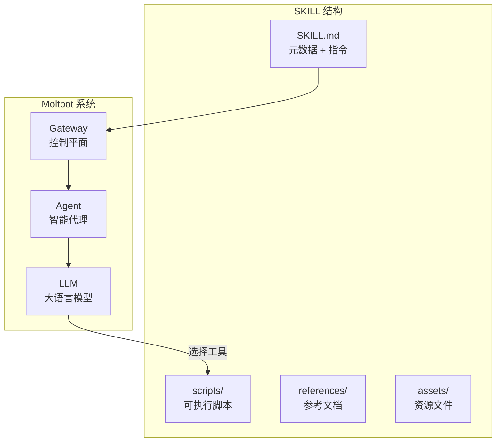

# SKILL 开发与安装完全指南

> Moltbot 技能扩展系统 (AgentSkills) 的开发、安装与配置教程

## 目录

1. [什么是 SKILL](#什么是-skill)
2. [SKILL 的加载位置与优先级](#skill-的加载位置与优先级)
3. [从 ClawdHub 安装 SKILL](#从-clawdhub-安装-skill)
4. [自主研发 SKILL](#自主研发-skill)
5. [SKILL.md 格式详解](#skillmd-格式详解)
6. [高级配置](#高级配置)
7. [发布到 ClawdHub](#发布到-clawdhub)

---

## 什么是 SKILL

**SKILL（技能）** 是 Moltbot 的可扩展模块，用于教授 AI Agent 如何使用特定工具或执行特定任务。每个 Skill 是一个目录，包含：

- `SKILL.md`（必需）：包含 YAML frontmatter 元数据和 Markdown 指令
- `scripts/`（可选）：可执行脚本（Python/Bash 等）
- `references/`（可选）：参考文档
- `assets/`（可选）：模板、图片等资源文件

### 核心概念



---

## SKILL 的加载位置与优先级

Skills 从三个位置加载，优先级从高到低：

| 优先级 | 位置 | 说明 |
|--------|------|------|
| 🥇 高 | `<workspace>/skills` | 当前工作区技能 |
| 🥈 中 | `~/.clawdbot/skills` | 全局管理/本地技能 |
| 🥉 低 | 内置 Skills | npm 包或 Moltbot.app 捆绑 |

> [!TIP]
> 如果同名 Skill 存在于多个位置，高优先级的会覆盖低优先级的。

### 额外目录配置

可通过 `~/.clawdbot/moltbot.json` 添加额外扫描目录：

```json5
{
  skills: {
    load: {
      extraDirs: [
        "~/Projects/agent-scripts/skills",
        "~/Projects/oss/some-skill-pack/skills"
      ]
    }
  }
}
```

---

## 从 ClawdHub 安装 SKILL

[ClawdHub](https://clawdhub.com)（也称 OpenClaw）是 Moltbot 的公共技能注册中心。

### 安装 CLI

```bash
# 使用 npm
npm i -g clawdhub

# 或使用 pnpm
pnpm add -g clawdhub
```

### 常用命令

#### 1. 搜索技能

```bash
clawdhub search "calendar"
clawdhub search "postgres backups" --limit 10
```

#### 2. 安装技能

```bash
# 安装到当前工作区
clawdhub install <skill-slug>

# 安装特定版本
clawdhub install <skill-slug> --version 1.0.0

# 强制覆盖已存在的技能
clawdhub install <skill-slug> --force
```

#### 3. 更新技能

```bash
# 更新单个技能
clawdhub update <skill-slug>

# 更新所有已安装的技能
clawdhub update --all
```

#### 4. 查看已安装技能

```bash
clawdhub list
```

### Moltbot CLI 技能命令

```bash
# 列出所有技能
moltbot skills list

# 只显示符合条件的技能
moltbot skills list --eligible

# 查看技能详情
moltbot skills info <name>

# 检查技能依赖
moltbot skills check
```

---

## 自主研发 SKILL

### 快速开始：创建第一个 Skill

#### 步骤 1：创建目录

```bash
mkdir -p ~/clawd/skills/hello-world
```

#### 步骤 2：创建 SKILL.md

```markdown
---
name: hello_world
description: A simple skill that says hello. Use when user asks for a greeting.
---

# Hello World Skill

When the user asks for a greeting, use the `echo` tool to say "Hello from your custom skill!".
```

#### 步骤 3：刷新 Moltbot

```bash
# 方法1：让 Agent 刷新
# 对 Moltbot 说："refresh skills"

# 方法2：重启 Gateway
moltbot gateway --force
```

### 使用 skill-creator 脚本初始化

推荐使用内置的 `skill-creator` 工具来创建标准化的 Skill：

```bash
# 基本初始化
python skills/skill-creator/scripts/init_skill.py my-skill --path ./skills

# 包含脚本和参考文档目录
python skills/skill-creator/scripts/init_skill.py my-skill --path ./skills --resources scripts,references

# 包含示例文件
python skills/skill-creator/scripts/init_skill.py my-skill --path ./skills --resources scripts --examples
```

### Skill 目录结构示例

```
my-skill/
├── SKILL.md                 # 必需：元数据 + 指令
├── scripts/                 # 可选：可执行脚本
│   └── run.py
├── references/              # 可选：参考文档
│   └── api_docs.md
└── assets/                  # 可选：资源文件
    └── template.html
```

### 完整示例：图片生成 Skill

查看 [nano-banana-pro](file:///Users/x/workspace/boltbot/skills/nano-banana-pro/SKILL.md) 获取完整示例：

```markdown
---
name: nano-banana-pro
description: Generate or edit images via Gemini 3 Pro Image (Nano Banana Pro).
homepage: https://ai.google.dev/
metadata: {"moltbot":{"emoji":"🍌","requires":{"bins":["uv"],"env":["GEMINI_API_KEY"]},"primaryEnv":"GEMINI_API_KEY","install":[{"id":"uv-brew","kind":"brew","formula":"uv","bins":["uv"],"label":"Install uv (brew)"}]}}
---

# Nano Banana Pro (Gemini 3 Pro Image)

Use the bundled script to generate or edit images.

Generate
\`\`\`bash
uv run {baseDir}/scripts/generate_image.py --prompt "your image description" --filename "output.png"
\`\`\`
```

---

## SKILL.md 格式详解

### Frontmatter 字段

| 字段 | 必需 | 说明 |
|------|------|------|
| `name` | ✅ | Skill 名称（小写字母、数字、连字符） |
| `description` | ✅ | 技能描述，用于触发判断 |
| `homepage` | ❌ | 项目主页 URL |
| `user-invocable` | ❌ | 是否可作为用户斜杠命令（默认 true） |
| `disable-model-invocation` | ❌ | 是否从模型提示中排除（默认 false） |
| `metadata` | ❌ | JSON 格式的高级配置 |

### metadata.moltbot 配置

```json
{
  "moltbot": {
    "emoji": "🔧",
    "always": true,
    "os": ["darwin", "linux"],
    "requires": {
      "bins": ["python3"],
      "anyBins": ["npm", "pnpm"],
      "env": ["API_KEY"],
      "config": ["browser.enabled"]
    },
    "primaryEnv": "API_KEY",
    "install": [
      {
        "id": "brew",
        "kind": "brew",
        "formula": "python@3.11",
        "bins": ["python3"],
        "label": "Install Python 3.11 (brew)"
      }
    ]
  }
}
```

#### 安装器类型

| kind | 说明 | 必需字段 |
|------|------|----------|
| `brew` | Homebrew 安装 | `formula`, `bins` |
| `node` | npm/pnpm/yarn 全局安装 | `package`, `bins` |
| `go` | go install 安装 | `package`, `bins` |
| `uv` | Python uv 安装 | `package`, `bins` |
| `download` | 直接下载 | `url` |

### 使用 {baseDir} 变量

在 SKILL.md 中可使用 `{baseDir}` 引用技能目录路径：

```bash
uv run {baseDir}/scripts/my_script.py --arg value
```

---

## 高级配置

### 在 moltbot.json 中配置技能

`~/.clawdbot/moltbot.json` 示例：

```json5
{
  skills: {
    // 仅启用指定的内置技能（可选）
    allowBundled: ["gemini", "peekaboo"],
    
    // 加载配置
    load: {
      extraDirs: ["~/my-skills"],
      watch: true,           // 监听文件变化
      watchDebounceMs: 250   // 防抖时间
    },
    
    // 安装偏好
    install: {
      preferBrew: true,
      nodeManager: "npm"     // npm | pnpm | yarn | bun
    },
    
    // 单个技能配置
    entries: {
      "nano-banana-pro": {
        enabled: true,
        apiKey: "YOUR_API_KEY_HERE",
        env: {
          GEMINI_API_KEY: "YOUR_API_KEY_HERE"
        }
      },
      "some-skill": { enabled: false }
    }
  }
}
```

### 环境变量注入

技能运行时，Moltbot 会：
1. 读取技能元数据
2. 应用 `skills.entries.<key>.env` 或 `apiKey` 到 `process.env`
3. 构建包含符合条件技能的系统提示
4. 运行结束后恢复原始环境

> [!WARNING]
> 沙盒模式下，技能进程运行在 Docker 容器中，不继承宿主机的 `process.env`。需要通过 `agents.defaults.sandbox.docker.env` 配置。

---

## 发布到 ClawdHub

### 登录

```bash
# 浏览器登录
clawdhub login

# 或使用 Token
clawdhub login --token <your-token>
```

### 发布单个技能

```bash
clawdhub publish ./my-skill \
  --slug my-skill \
  --name "My Skill" \
  --version 1.0.0 \
  --tags latest
```

### 批量同步

```bash
# 扫描并发布所有技能
clawdhub sync --all

# 干运行模式（预览）
clawdhub sync --dry-run

# 指定版本递增类型
clawdhub sync --all --bump minor
```

### 打包技能

使用 `skill-creator` 工具打包：

```bash
python skills/skill-creator/scripts/package_skill.py ./my-skill

# 指定输出目录
python skills/skill-creator/scripts/package_skill.py ./my-skill ./dist
```

打包脚本会：
1. ✅ 验证 YAML frontmatter
2. ✅ 检查命名规范
3. ✅ 验证目录结构
4. ✅ 生成 `.skill` 文件（zip 格式）

---

## 最佳实践

> [!IMPORTANT]
> **简洁是关键**：上下文窗口是共享资源，只添加 AI 不具备的知识。

### 设计原则

1. **渐进式披露**
   - 元数据（name + description）~100 词
   - SKILL.md 正文 <5k 词
   - 脚本/资源按需加载

2. **自由度匹配**
   - 高自由度：使用文本指令
   - 中等自由度：使用带参数的脚本
   - 低自由度：使用精确脚本

3. **资源组织**
   - `scripts/`：确定性、重复使用的代码
   - `references/`：按需加载的文档
   - `assets/`：输出使用的资源

### 安全注意事项

- ⚠️ 第三方技能视为受信任代码，启用前请审查
- ⚠️ 不受信任的输入优先使用沙盒运行
- ⚠️ 避免在提示和日志中暴露密钥

---

## 参考文档

- [官方 Skills 文档](file:///Users/x/workspace/boltbot/docs/tools/skills.md)
- [创建技能指南](file:///Users/x/workspace/boltbot/docs/tools/creating-skills.md)
- [ClawdHub 指南](file:///Users/x/workspace/boltbot/docs/tools/clawdhub.md)
- [Skills 配置参考](file:///Users/x/workspace/boltbot/docs/tools/skills-config.md)
- [skill-creator SKILL](file:///Users/x/workspace/boltbot/skills/skill-creator/SKILL.md)

---

*最后更新：2026-01-31*
